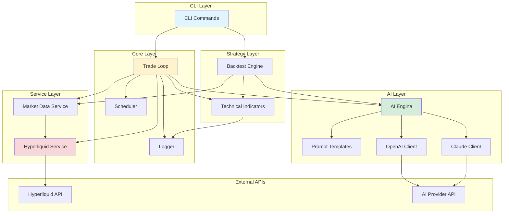
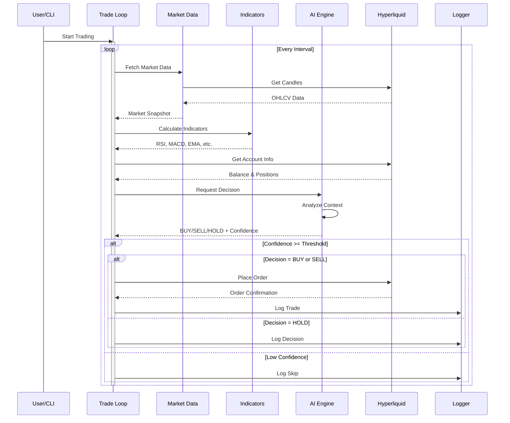
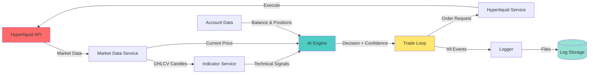
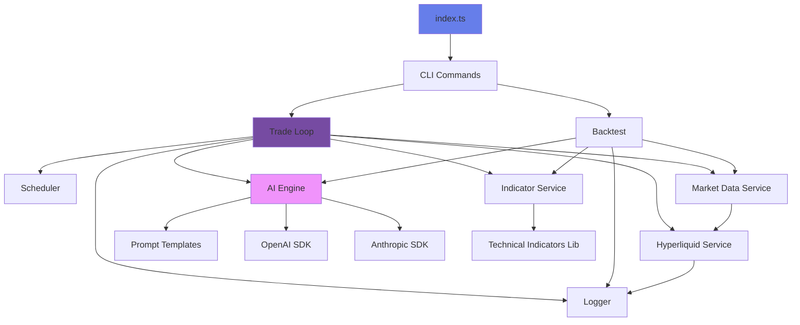
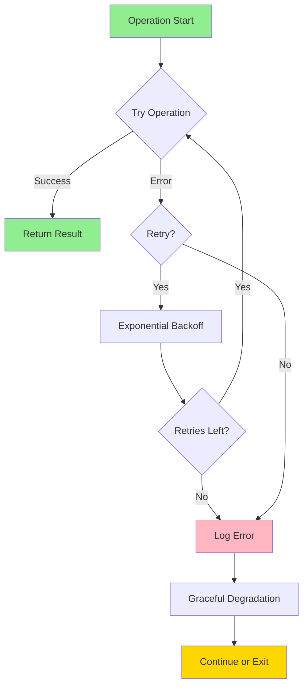

# Trading AI Agent - Architecture Diagram

## System Architecture

## Trading Flow Sequence

## Data Flow

## Module Dependencies

## Component Responsibilities

| Component | Responsibility |
|-----------|---------------|
| **Trade Loop** | Orchestrates trading cycle, manages state |
| **Scheduler** | Manages periodic task execution |
| **Market Data Service** | Fetches and normalizes market data |
| **Indicator Service** | Calculates technical indicators |
| **AI Engine** | Generates trading decisions using LLM |
| **Hyperliquid Service** | Executes trades and fetches account data |
| **Backtest Engine** | Simulates strategy on historical data |
| **Logger** | Structured logging with rotation |
| **CLI** | User interface and command execution |

## Error Handling Flow

